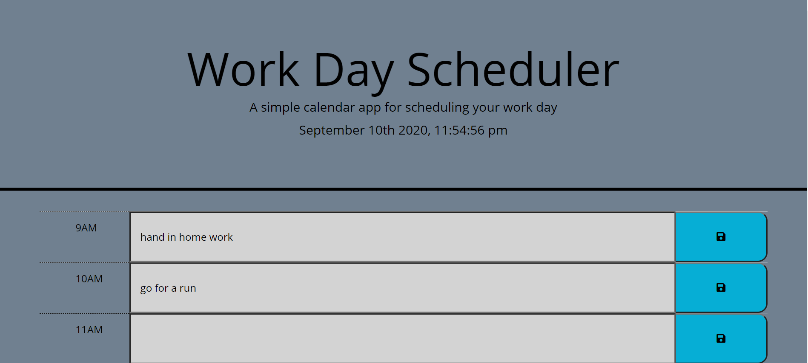

# work-day-scheduler

https://zanepemberton.github.io/work-day-scheduler/

This is a simple work day scheduler application that will allow you to save events for any hour of the day, anytime you need! 

And dont worry about refreshing the page and leaving this schedular will save your schedule until you dont need it too. 

We've even colored the time stamps for your conveniance, green is for future, red is for present and gray is for past.

